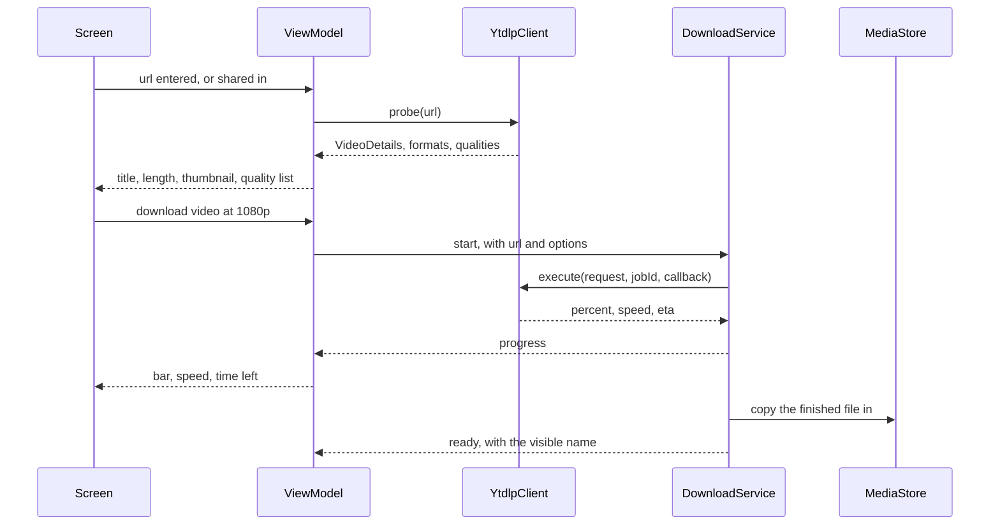

# YTDLP Mobile: design

Date: 2026-09-21

## Goal

The web version's flow, on the phone, with the phone's own address. Nothing else changes. The server failed because a datacenter address is refused by YouTube, and a phone is not in one.

The flow to reproduce, step for step:

1. A URL arrives, pasted or shared from another app.
2. Check it. The page shows the title, the length, the thumbnail.
3. Choose: video MP4 at a quality, audio MP3, or a format from the full list.
4. Watch percent, speed and time left.
5. The file lands somewhere the phone can see.

## Architecture: MVVM

One `ViewModel` holds one `StateFlow<UiState>`. Compose reads it and sends events back. The reason is not ceremony: it puts every rule that can be wrong into plain Kotlin that runs on the JVM, so the rules are tested without a device. The web version earned its confidence that way, and the same rules apply here.

| Layer | Package | Depends on Android? | Tested how |
|---|---|---|---|
| Domain model | `domain.model` | No | Not needed, data only |
| Quality list | `domain` | No | JVM unit test |
| Option builder | `domain` | No | JVM unit test |
| Job state | `domain` | No | JVM unit test |
| yt-dlp client | `data` | Yes, the library | Device only |
| MediaStore writer | `data` | Yes | Device only |
| ViewModel | `ui` | Coroutines only | JVM unit test with a fake client |
| Screen | `ui` | Compose | By eye, and by running it |
| Download service | `service` | Yes | Device only |

The two pieces that carry the real logic, the quality list and the option builder, are pure functions over my own model types. The library's `VideoInfo` is mapped into those types in one thin place, so a change in the library touches one file.

## Flow

## Decisions that differ from the web version

**The file is copied, not written in place.** yt-dlp is a native process holding a raw path, so it cannot write into the public Downloads or Music folders under scoped storage. The download goes to app private storage, then the bytes are copied into MediaStore and the private copy is deleted. The user sees the file in their music player and file manager, and it survives uninstalling the app.

**A foreground service, not WorkManager.** yt-dlp runs as a forked native process holding a live stdout pipe, so there is nothing for WorkManager to defer or retry. The service type is `dataSync`. Android 15 caps that at six hours a day and then calls `onTimeout`, which must call `stopSelf` within a few seconds or the process is killed. That handler is not optional.

**A cancel keeps the partial file.** Only a success is finished, so only a success deletes the work folder. A cancel is a pause and a failure is the case resuming exists for, so both keep it, and pressing download again carries on from where it stopped. Folders nobody returns to are swept by age, the way the server's janitor worked. Note that `.part` and `.ytdl` must go together or not at all: with the `.part` file present and the `.ytdl` file missing, yt-dlp restarts at fragment zero but appends to the old bytes, which produces a corrupt file that still looks like a success. Deleting the whole folder satisfies that, deleting files inside it does not.

**The library's cancel does not kill everything.** `destroyProcessById` stops the yt-dlp process, but its attempt to kill grandchildren runs `pstree` and `grep -oP`, neither of which exists on Android, and it fails silently. A cancel during conversion can leave an ffmpeg process running.

**The share target is the main entrance.** An `ACTION_SEND` filter for `text/plain` means pressing Share in another app and picking this one. No copying URLs. This is the part that makes the phone better than the web page ever was.

## Rules carried over, unchanged

| Rule | Where it lives |
|---|---|
| Video: `bv*+ba/b`, or `bv*[height<=N]+ba/b[height<=N]/bv*+ba/b` when a quality is chosen | option builder |
| Audio: `ba/b` plus `-x --audio-format mp3` | option builder |
| A chosen format: `<id>+ba/<id>`, so the server never decides whether it carries audio | option builder |
| Quality list: keep video formats with a real height, group by height, take the largest in each group, add the largest audio size, sort high to low | quality list |
| A format with no reported size shows the height alone. The size is an estimate | quality list |
| Never set `--ffmpeg-location`. The library adds it, and options append rather than replace | yt-dlp client |

## Build order

1. Domain model, quality list, option builder, with their JVM tests. No Android.
2. The yt-dlp client, mapping `VideoInfo` into the model.
3. The ViewModel and its test, with a fake client.
4. The screen.
5. The service, MediaStore and the share target.

Each step leaves something that builds and passes its tests.

## What the first device run changed

Written after running on the emulator on 2026-09-21. Each of these was a
belief that the device disproved.

### Bounded retries, not endless ones

The first option set asked for `--retries infinite`, `--fragment-retries
infinite` and `--throttled-rate 10K`. The reasoning was that a mobile link
comes back, so there is no reason to give up on a count.

On the device that set earned `HTTP Error 429: Too Many Requests` from the
test connection, and every request after it, including the lightweight
probe, was refused. The spike had downloaded the same video from the same
emulator twenty minutes earlier using the defaults.

Two things caused it. Endless retries against a site answering 429 are a
hot loop aimed at a rate limiter. `--throttled-rate` forces a full
re-extraction of the page every time the speed dips, which multiplies
requests at the moment the link is weakest.

Retries are now bounded at 10 and the speed floor is gone. What stays is
the part yt-dlp really does leave out: there is no sleep between retries by
default, so ten retries burn in seconds. The exponential backoff stays, and
so does `--abort-on-unavailable-fragments`, which stops a download
finishing with holes in the media.

Tests forbid `infinite` and `--throttled-rate` from returning.

### Surface, not a background modifier

Text was black in dark mode. `Modifier.background(colour)` paints pixels
and nothing else. `Surface(colour)` paints and also sets
`LocalContentColor` to the matching `on` role. With no `Surface` above it,
`LocalContentColor` stays at its default of black, so every `Text` without
an explicit colour is black whatever the theme says.

The `Surface` now lives inside `YTDLPMobileTheme`, so no screen can lose it
by forgetting one.

### The window theme needs a night variant

`android:Theme.Material.DayNight.NoActionBar` does not exist. The style is
declared twice under the same name instead, in `values` and in
`values-night`, which is what makes the window follow the system.

### No colour is written anywhere

Every role comes from the Material scheme. `Color.kt` is deleted, both
schemes are the parameterless defaults, and `colors.xml` holds nothing.

### Still unproven

Resuming has never run. Killing a download halfway and watching it carry on
is the one behaviour no unit test here can settle.

The app mints no proof token. The log shows `Unable to fetch GVS PO Token
for web client`, which makes a challenge more likely than it is for the
server version, which runs a provider. It was not the cause of the 429, and
it is the next thing to try if challenges keep coming from a clean address.

## Android 17: job folders moved to internal storage

On Android 17 the app lost its own `Android/data` folder. yt-dlp wrote
every job there, through `getExternalFilesDir`, so every download failed
before its first byte.

Job folders now live in `noBackupFilesDir/jobs`. That is internal storage,
a plain folder the app owns with no FUSE layer in between, and it is where
the library already unpacks and runs Python, so a native process can
plainly use it. It is on the same partition as `Android/data` on nearly
every phone, so there is no less room. It is left out of backup, because a
half download is worth nothing on another phone.

The old `Android/data/.../files/jobs` folder cannot be resumed from the new
place, so the startup sweep deletes it, as best effort.
